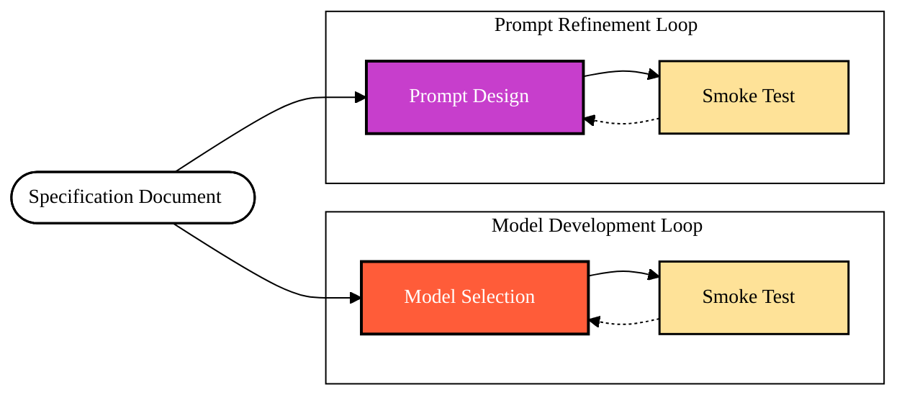

# Model and Prompt Development Loops

```mermaid
%%{init: {
  "theme": "base",
  "themeVariables": {
    "fontFamily": "Segoe UI, sans-serif",
    "primaryColor": "#ffffff",
    "primaryTextColor": "#000000",
    "primaryBorderColor": "#000000",
    "lineColor": "#000000",
    "clusterBkg": "#ffffff",
    "clusterBorder": "#000000",
    "background": "#ffffff",
    "fontSize": "14px"
  }
}}%%
graph LR
    A([Specification Document])

    %% Model loop (top)
    subgraph Model_Loop["Model Development Loop"]
        B[Model Selection] --> C[Smoke Test]
        C -.-> B
    end

    %% Prompt loop (bottom)
    subgraph Prompt_Loop["Prompt Refinement Loop"]
        D[Prompt Design] --> E[Smoke Test]
        E -.-> D
    end

    A --> B
    A --> D

    %% Styling
    style A fill:#ffffff,color:#000000,stroke:#000000,stroke-width:1.5px
    style B fill:#FF5C39,color:#ffffff,stroke:#000000,stroke-width:2px
    style D fill:#C73ECC,color:#ffffff,stroke:#000000,stroke-width:2px
    style C fill:#FEE298,color:#000000,stroke:#000000,stroke-width:1.5px
    style E fill:#FEE298,color:#000000,stroke:#000000,stroke-width:1.5px
```